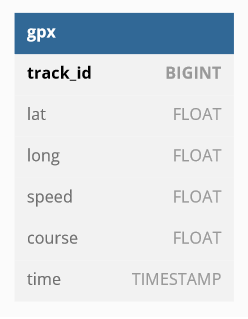

# Geospatial Data Engineer Coding Challenge

## Challenge

Build a data pipeline to extract, transform, and load geospatial data into a data warehouse so that it is possible to query the data for specific insights.

If writing code, use Python as the main programming language to build the data pipeline.

Extract the data from the provided zip of GPX files, and transform the data into a format that is suitable for loading into a data warehouse.

Load the transformed data into Redshift

Write a script to automate the entire data pipeline process, including extracting, transforming, and loading the data.

Explain any code you wrote and the data pipeline, including the data model and any assumptions made and why you chose the structures you did.

## Bonus points:
Ensure pipeline cleans up GPS anomalies (e.g. outlier points due to GPS connectivity issues)

Ensure pipeline removes any “on land” tracks

## Insight Queries
Write queries to answer the following questions:

What percentage of tracks exceeded 10 knots (nautical miles per hour)

Breakdown tracks to and from Cowes to find the origin/destination (nearest town) and what percentage started/ended in each

# Results

I analyzed the data in the notebook data_exploration.ipynb

It's the first time i'm working with GPS data, i did not find any outliers in latitude and longitude, all datapoints seem to be coming from a cohesive and contained space

I found a few entries where speed and course have a vlaue of -1, from my understanding these points are errors in the system so i removed them from the dataframe.

I did not find a quick solution for assessing if a point is "on land"

I also could not quickly find how to determine if a track starts/ends in Cowes

#### What percentage of tracks exceeded 10 knots (nautical miles per hour)?

the gpx files had no mention of units of measure, if considering the speed recorded there in m/s then the answer is 5.5%

if the speed is already recorded in knots then 1.43%

I think the speed is most likely recorded in m/s

## Data Model

Except for the timestamp, all entry are stored as floats, double precision datatype on redshift. 

I added a track_id column that is simply the index number from the pandas dataframe

# ETL

Running etl.py will process, clean and upload the data to redshift.

Latitude, longitude, speed and course already came as a float, i did not modify their type in pandas and uploaded them to a table with datatype "double precision"

The timestamp datatype gets modified to datetime before writing

The agglomerated data is written to a csv in s3, i found this intermediate step very helpful to have a "savepoint" halfway through the process as well as allowing historic values to be preserved if versioning is enabled on s3

The file sql_queries.py holds the 3 sql queries that are ran on redshift to complete the ETL

first the table is deleted (if existing)

then a new table is created

then it is populated with the data from the csv previously created on s3

I wanna point out that i do not have an AWS account at the moment so i could not debug the s3/redshift part of the etl properly, i simply wrote it using parts of old code

I am of course open to any questions or clarifying my thought process

